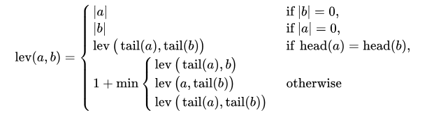

# Answer

## Rust
```rust
#use std::cmp::min;
fn levenshtein_distance(s1: &str, s2: &str) -> usize {
    let (len_s1, len_s2) = (s1.len(), s2.len());
    let mut cache = vec![vec![0; len_s2 + 1]; len_s1 + 1];

    (0..=len_s1).for_each(|i| cache[i][0] = i);
    (0..=len_s2).for_each(|j| cache[0][j] = j);

    for (i, char_s1) in s1.chars().enumerate() {
        for (j, char_s2) in s2.chars().enumerate() {
            let cost = if char_s1 == char_s2 { 0 } else { 1 };
            cache[i + 1][j + 1] = min(
                min(cache[i][j + 1] + 1, cache[i + 1][j] + 1),
                cache[i][j] + cost,
            );
        }
    }

    cache[len_s1][len_s2]
}
#fn main() {
    #let str1 = "kitten";
    #let str2 = "sitting";
    #let distance = levenshtein_distance(str1, str2);
#
    #println!(
        #"The edit distance between '{}' and '{}' is: {}",
        #str1, str2, distance
    #);
#}
```

